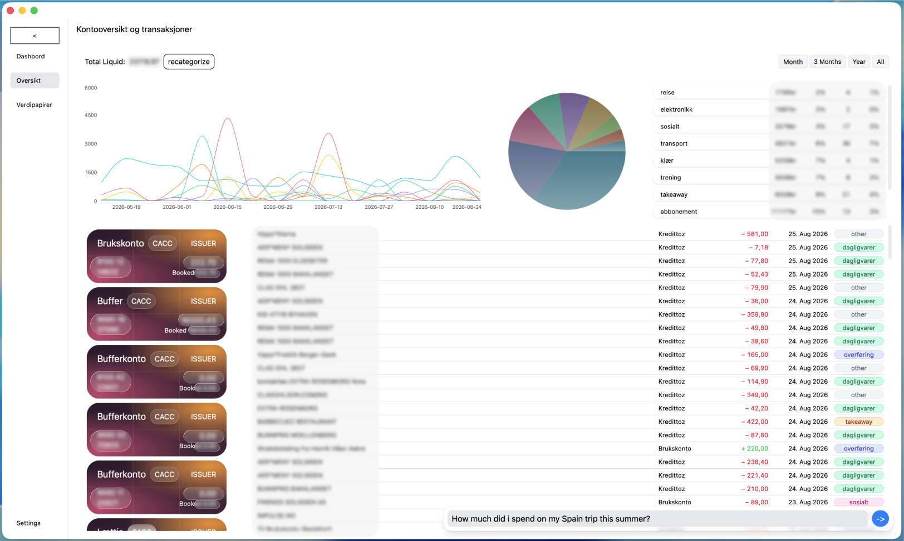

# Bank-Dashboard

## Background for this project

Since my personal bank Storebrand is missing an analytics platform for transactions, and transactions are extremely hard to find back to in my banks webplatform or app; **I decided to create my own.**

### Implementation

After research if found out that all banks in EU must comply to PSD2 by having APIs that authorized companies can use to fetch customer transaction data.

``
"PSD2 (Revised Payment Services Directive) is an EU directive for payment services that was introduced in Norway on 14 September 2019. Its aim is to increase security in online commerce, strengthen consumer rights, and open up for more competition and innovation by requiring banks to share account information with authorised third parties if the customer permits it." - Finans Norge
``

To qualify for these API's you must have an AS and also send a formal application to Finanstilsynet stating the company roles and how you comply to GDPR trough gathering, processing, storing, etc..., even if you only want to gather your very on data.
Therefore i found a business that is qualified and that lets you fetch your own data trough BankID OIDC.

From here i can fetch all my account-data in real time, and also fetch all transactions that has been booked within the last 50 days. To store transactions for longer i store all new transactions to Postgres database in Supabase.

### The application today

This application is now a dashboard for analytics of my own spendings and incomes.
What the dashboard provides that my bank does not:

- Categorization of transactions: The application uses a ruleset (keywords) to initially categorize a transaction  into a specific category. For example "Bunnpris" is "dagligvare" and "Downtown" is "sosialt".
- 
  If a transactions does not fit inside a category it will then be sent in a prompt to an OPENAI API that will 
  try to categorize it, but may also still end up in "other" in the case of it actually not fitting inside a category.
- Lets me know specifically how much i spend on each category for each week and gives clear analytics trough charts.
  
- Lets me use AI to search for spexific questions about expenses for example "how much did i spend on my spain trip from 01.06 to 15.06" (Still under development).

- There are also other features to come, such as just simple filtering in the analytics between weeks, moths, year, and all time.

  Furthermore i have also planned to have a page where you can set the budget and then compare to actual spendings.
  Stocks and funds are also planned for this, but will not go as smoothly because my broker does not have a public API.



#### Want to try it out?

```coming soon...```
